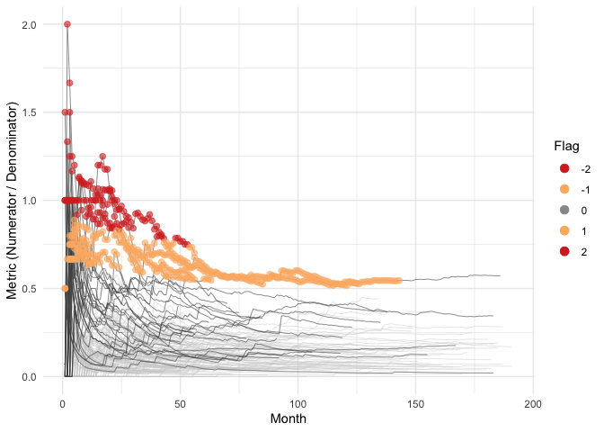
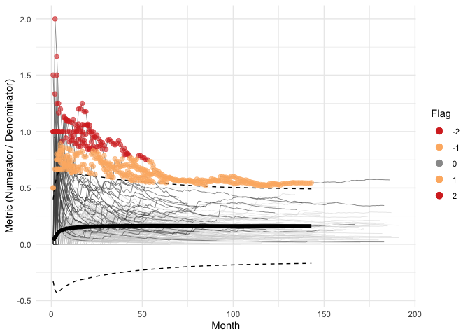
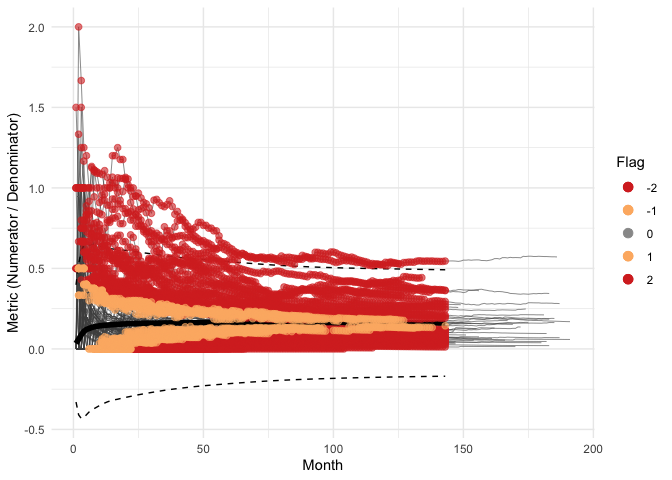
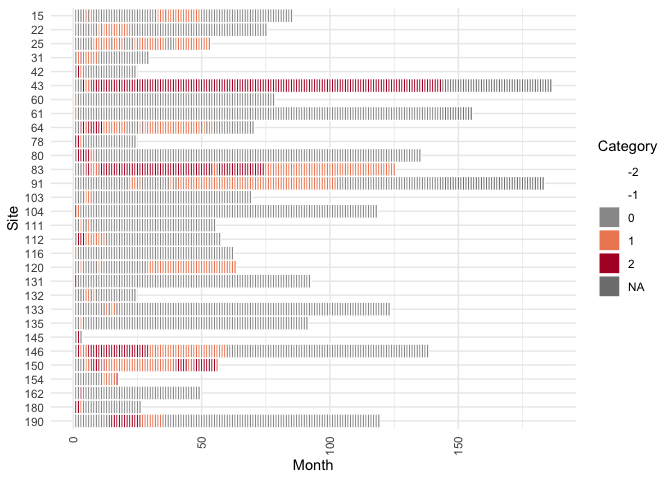

<!-- README.md is generated from README.Rmd. Please edit that file -->

# gsm.timez

<!-- badges: start -->

[](https://github.com/IMPALA-Consortium/gsm.timez/actions/workflows/R-CMD-check.yaml)
[](https://app.codecov.io/gh/IMPALA-Consortium/gsm.timez)
<!-- badges: end -->

## Overview

The `gsm.timez` package provides functions for generating cumulative
event timelines and calculating z-scores for clinical trial monitoring.
It is part of the IMPALA Consortium’s GSM (Good Statistical Monitoring)
framework.

The package includes five main functions:

- **`Timeline()`**: Generates a site-level timeline of cumulative
  numerator events (e.g., adverse events) over sequential months.
- **`TimeZScore()`**: Calculates z-scores for each group (e.g., site)
  based on the rate of events, enabling identification of sites with
  unusual event patterns.
- **`Flag()`**: Adds flag columns to analyzed data identifying possible
  statistical outliers based on threshold comparisons. This is an alias
  for `gsm.core::Flag()`.
- **`Visualize()`**: Creates a line plot showing site metrics over time
  with dots colored by flag value to highlight outliers.
- **`VisualizeBoxplot()`**: Creates boxplots showing the distribution of
  Metric values for each month, with individual points colored by flag
  value.

## Installation

You can install the development version of gsm.timez from
[GitHub](https://github.com/) with:

``` r
# install.packages("pak")
pak::pak("IMPALA-Consortium/gsm.timez")
```

## Quick Start

``` r
library(gsm.timez)
library(dplyr)

# Prepare data
dfSubjects <- clindata::rawplus_dm
dfNumerator <- clindata::rawplus_ae
dfDenominator <- clindata::rawplus_visdt %>%
  dplyr::mutate(visit_dt = as.Date(visit_dt, "%Y-%m-%d"))

# Full pipeline: Timeline -> Z-Score -> Flag -> Visualize
gsm.timez::Timeline(
  dfSubjects            = dfSubjects,
  dfNumerator           = dfNumerator,
  dfDenominator         = dfDenominator,
  strGroupCol           = "invid",
  strSubjectCol         = "subjid",
  strNumeratorDateCol   = "aest_dt",
  strDenominatorDateCol = "visit_dt"
) %>%
  gsm.timez::TimeZScore() %>%
  gsm.timez::Flag() %>%
  gsm.timez::Visualize()
```



## Sample Report

A full interactive HTML report generated with `Report_Timeline()` is
available:

- [Sample Timeline
  Report](https://impala-consortium.github.io/gsm.timez/report_timeline_sample.html)

## Learn More

For detailed documentation on each function, including parameters,
output columns, and advanced usage examples, see the [Detailed Usage
vignette](https://impala-consortium.github.io/gsm.timez/articles/DetailedUsage.html).

## Quality Control

Since {gsm} is designed for use in a GCP framework, we have conducted
extensive quality control as part of our development process. In
particular, we do the following during early development:

- **Unit Tests** - Unit tests are written for all core functions, 100%
  coverage required.
- **Workflow Tests** - Additional unit tests confirm that core workflows
  behave as expected.
- **Function Documentation** - Detailed documentation for each exported
  function with examples is maintained with Roxygen.
- **Package Checks** - Standard package checks are run using GitHub
  Actions and must be passing before PRs are merged.
- **Continuous Integration** - Continuous integration is provided via
  GitHub Actions.
- **Code Formatting** - Code is formatted with {styler} before each
  release.
- **Contributor Guidelines** - Detailed contributor guidelines including
  step-by-step processes for code development and releases are provided
  as a vignette.
- **Code Demonstration** - Cookbook Vignette provides demos and
  explanations for code usage.

## Scoring Methods Comparison

The package provides three different approaches for calculating
z-scores, each with different statistical properties:

| Method                       | Function                            | Distribution | Sample Size Adjusted | Scale Factor     |
|------------------------------|-------------------------------------|--------------|----------------------|------------------|
| Empirical Z-Score            | `TimeZScore()`                      | Normal       | No                   | `sd`             |
| Empirical Z-Score (Adjusted) | `TimeZScore(bAdjustForSize = TRUE)` | Normal       | Yes                  | `sd / sqrt(n)`   |
| Funnel Plot                  | `TimeZScoreFunnel()`                | Poisson      | Yes                  | `sqrt(lambda/n)` |

### Empirical Z-Score (Default)

The default `TimeZScore()` uses an empirical z-score that treats all
sites equally regardless of sample size:

``` r
Score = (Metric - mean) / sd
```

### Empirical Z-Score with Sample Size Adjustment

Setting `bAdjustForSize = TRUE` adjusts the scaling factor for sample
size, giving larger sites narrower bounds:

``` r
Score = (Metric - mean) / (sd / sqrt(Denominator))
```

### Funnel Plot Method (Poisson-based)

`TimeZScoreFunnel()` uses the funnel plot methodology from Zink et al.,
which assumes count data follows a Poisson distribution. The standard
error is derived from Poisson variance assumptions, and larger sites
receive narrower confidence bounds:

``` r
Score = (Metric - OverallMetric) / sqrt(OverallMetric * Factor / Denominator)
```

### Example: Comparing All Three Methods

``` r
library(gsm.timez)
library(dplyr)

# Prepare data
dfSubjects <- clindata::rawplus_dm
dfNumerator <- clindata::rawplus_ae
dfDenominator <- clindata::rawplus_visdt %>%
  dplyr::mutate(visit_dt = as.Date(visit_dt, "%Y-%m-%d"))

# Create timeline
dfTimeline <- Timeline(
  dfSubjects = dfSubjects,
  dfNumerator = dfNumerator,
  dfDenominator = dfDenominator,
  strGroupCol = "siteid",
  strSubjectCol = "subjid",
  strNumeratorDateCol = "aest_dt",
  strDenominatorDateCol = "visit_dt"
)
```

**Method 1: Empirical Z-Score (default)**

``` r
dfAnalyzed1 <- dfTimeline %>% TimeZScore()
dfFlagged1 <- dfAnalyzed1 %>% Flag()
dfBounds1 <- TimeZScore_PredictBounds(dfAnalyzed1)

Visualize(dfFlagged1, dfBounds = dfBounds1)
```



**Method 2: Empirical Z-Score with sample size adjustment**

``` r
dfAnalyzed2 <- dfTimeline %>% TimeZScore(bAdjustForSize = TRUE)
dfFlagged2 <- dfAnalyzed2 %>% Flag()
dfBounds2 <- TimeZScore_PredictBounds(dfAnalyzed2)

Visualize(dfFlagged2, dfBounds = dfBounds2)
```



**Method 3: Funnel Plot (Poisson-based)**

This method requires the `gsm.core` package:

``` r
dfAnalyzed3 <- dfTimeline %>% TimeZScoreFunnel()
dfFlagged3 <- dfAnalyzed3 %>% Flag(vThreshold = c(-1.5, -1, 2, 3))
dfBounds3 <- TimeZScoreFunnel_PredictBounds(dfAnalyzed3, vThreshold = c(-1.5, -1, 2, 3))

VisualizeFunnel(dfFlagged3)
```



**Note:** The funnel method uses asymmetric thresholds
(`c(-1.5, -1, 2, 3)`) because under-reporting scores are mathematically
bounded. Since Metric \>= 0, the minimum possible score is approximately
`-sqrt(OverallMetric * Denominator / Factor)`, which is typically around
-1.5 to -2. Using symmetric thresholds like `c(-3, -2, 2, 3)` would make
under-reporting flags unreachable.

The choice of method depends on your analysis goals:

- **Empirical Z-Score**: Simple comparison against peer distribution
- **Size-Adjusted**: Account for variability differences due to sample
  size
- **Funnel Plot**: Formal statistical approach matching Zink et
  al. methodology

### Workflow Pattern (GSM-compatible)

Following the GSM ecosystem conventions, bounds are calculated
separately from visualization:

``` r
# 1. Analyze: Calculate scores
dfAnalyzed <- dfTimeline %>% TimeZScore()

# 2. Flag: Assign outlier flags based on Score thresholds
dfFlagged <- dfAnalyzed %>% Flag()

# 3. Bounds: Calculate visualization bounds (separate step)
dfBounds <- TimeZScore_PredictBounds(dfAnalyzed)

# 4. Visualize: Pass both flagged data and bounds
Visualize(dfFlagged, dfBounds = dfBounds)
```

This separation of concerns allows bounds to be reused across multiple
visualizations and aligns with the GSM ecosystem architecture.
