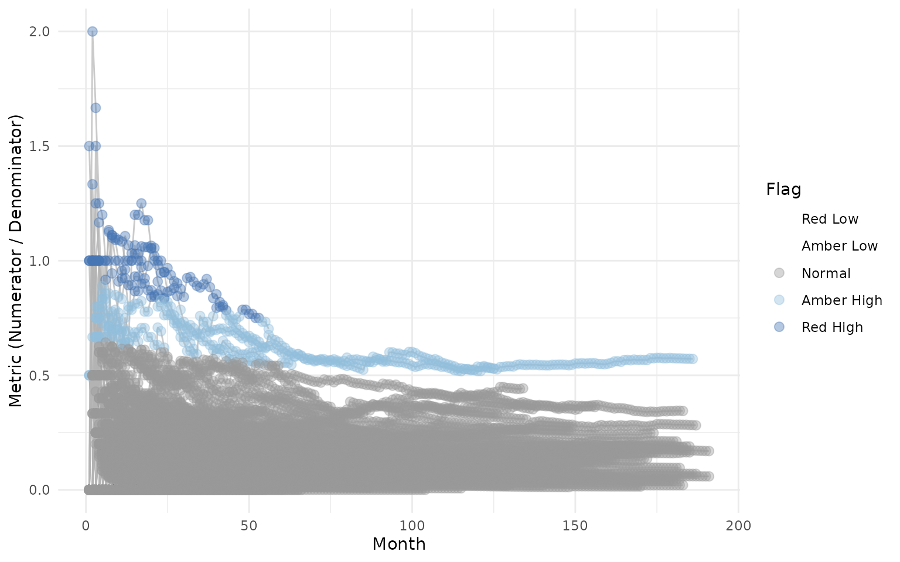
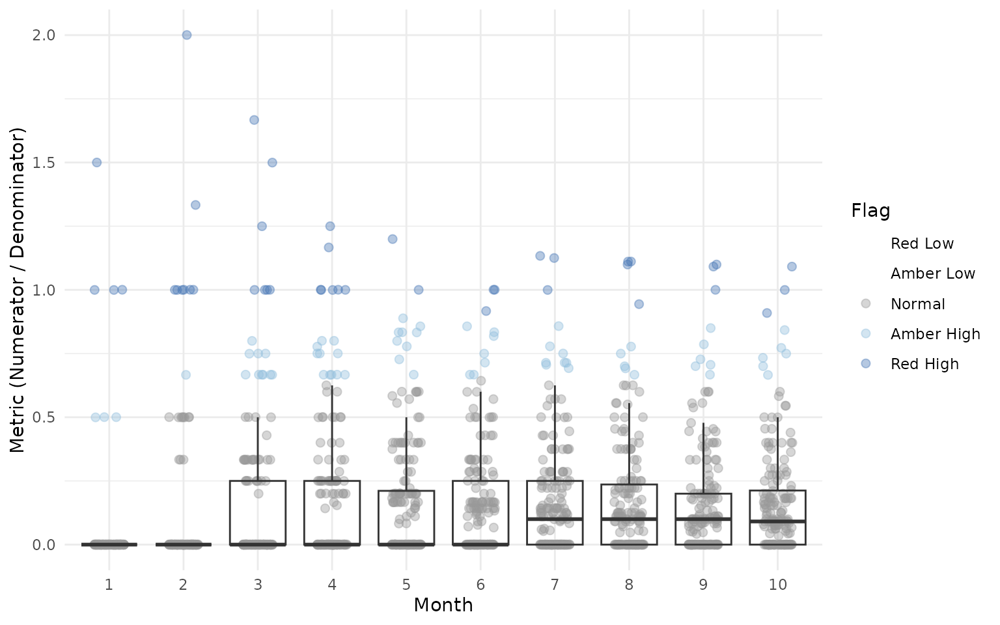

# Detailed Usage and Advanced Examples

This vignette provides detailed documentation for each function in
`gsm.timez`, including parameter descriptions, output columns, and
advanced usage examples.

## Setup

``` r
library(gsm.timez)
library(dplyr)
```

## Data Preparation

We’ll use sample clinical trial data from the `clindata` package to
demonstrate the functions. The key datasets are: - `rawplus_dm`: Subject
demographics with site assignments - `rawplus_ae`: Adverse event records
with dates - `rawplus_visdt`: Visit date records

``` r
# Load subject data
dfSubjects <- clindata::rawplus_dm

# Load adverse events (numerator)
dfNumerator <- clindata::rawplus_ae

# Load visit dates (denominator) - convert to Date type
dfDenominator <- clindata::rawplus_visdt %>%
  dplyr::mutate(visit_dt = as.Date(visit_dt, "%Y-%m-%d"))
```

Let’s preview each dataset:

``` r
# Subjects: key columns are subjid (subject ID) and siteid (site/group)
knitr::kable(head(dfSubjects[, c("subjid", "siteid", "studyid")], 5))
```

| subjid | siteid | studyid        |
|:-------|:-------|:---------------|
| 0496   | 5      | AA-AA-000-0000 |
| 1350   | 78     | AA-AA-000-0000 |
| 0539   | 139    | AA-AA-000-0000 |
| 0329   | 162    | AA-AA-000-0000 |
| 0429   | 29     | AA-AA-000-0000 |

``` r

# Numerator (AEs): key columns are subjid and aest_dt (AE start date)
knitr::kable(head(dfNumerator[, c("subjid", "aest_dt")], 5))
```

| subjid | aest_dt    |
|:-------|:-----------|
| 0496   | 2015-01-10 |
| 0496   | 2014-02-28 |
| 1350   | 2017-11-13 |
| 1350   | 2017-11-19 |
| 1350   | 2019-03-26 |

``` r

# Denominator (Visits): key columns are subjid and visit_dt (visit date)
knitr::kable(head(dfDenominator[, c("subjid", "visit_dt")], 5))
```

| subjid | visit_dt   |
|:-------|:-----------|
| 0496   | 2013-11-26 |
| 0496   | 2015-03-27 |
| 0496   | 2014-10-10 |
| 0496   | 2014-09-14 |
| 0496   | 2014-02-05 |

## Timeline Function

The [`Timeline()`](../reference/timeline.md) function generates a
site-level timeline of cumulative numerator events over sequential
months.

### Parameters

- `dfSubjects`: Data frame with subject IDs and grouping variables
- `dfNumerator`: Data frame with event records (numerator)
- `dfDenominator`: Data frame with time point records (denominator)
- `strGroupCol`: Column name for grouping (e.g., “siteid”)
- `strSubjectCol`: Column name for subject ID
- `strNumeratorDateCol`: Date column in numerator data
- `strDenominatorDateCol`: Date column in denominator data

### Basic Usage

``` r
dfTimeline <- gsm.timez::Timeline(
  dfSubjects            = dfSubjects,
  dfNumerator           = dfNumerator,
  dfDenominator         = dfDenominator,
  strGroupCol           = "siteid",
  strSubjectCol         = "subjid",
  strNumeratorDateCol   = "aest_dt",
  strDenominatorDateCol = "visit_dt"
)

knitr::kable(head(dfTimeline))
```

| GroupID | GroupLevel | Numerator | Denominator | DenominatorMonth | NMonth |
|:--------|:-----------|----------:|------------:|:-----------------|-------:|
| 10      | siteid     |         0 |           1 | 2004-01-01       |      1 |
| 10      | siteid     |         0 |           1 | 2004-02-01       |      2 |
| 10      | siteid     |         0 |           2 | 2004-03-01       |      3 |
| 10      | siteid     |         2 |           3 | 2004-04-01       |      4 |
| 10      | siteid     |         2 |           5 | 2004-05-01       |      5 |
| 10      | siteid     |         2 |           7 | 2004-06-01       |      6 |

### Output Columns

The Timeline output contains one row per site-month combination. Column
names follow GSM standard PascalCase conventions:

- `GroupID`: Group identifier (e.g., site ID)
- `GroupLevel`: Name of the grouping column used
- `Numerator`: Cumulative count of numerator events (e.g., AEs) at the
  site
- `Denominator`: Cumulative count of visits at the site
- `DenominatorMonth`: The calendar month (Date, truncated to first of
  month)
- `NMonth`: Sequential month index for the site (1, 2, 3, …). This is
  the site’s “study month” - the first month with data is 1, the second
  is 2, etc.

## TimeZScore Function

The [`TimeZScore()`](../reference/TimeZScore.md) function takes the
output from [`Timeline()`](../reference/timeline.md) and calculates
cumulative z-scores for each row using an expanding window indexed by
month.

The z-score formula is:

$$z = \frac{Metric - mean(Metrics)}{sd(Metrics)}$$

Where `Metrics` includes all Metric values from all groups where
`NMonth <= current_NMonth`. This means:

- For month 1: z-scores are calculated using all Metrics from month 1
- For month 2: z-scores are calculated using all Metrics from months 1
  and 2
- And so on…

If fewer than 2 Metrics exist in the cumulative window, the Score is 0.

### Basic Usage

The function is designed to work seamlessly with
[`Timeline()`](../reference/timeline.md) output using the pipe operator:

``` r
dfTimeZScore <- gsm.timez::TimeZScore(dfTimeline)

knitr::kable(head(dfTimeZScore))
```

| GroupID | GroupLevel | Numerator | Denominator | DenominatorMonth | NMonth |    Metric |      Score |
|:--------|:-----------|----------:|------------:|:-----------------|-------:|----------:|-----------:|
| 10      | siteid     |         0 |           1 | 2004-01-01       |      1 | 0.0000000 | -0.1873328 |
| 10      | siteid     |         0 |           1 | 2004-02-01       |      2 | 0.0000000 | -0.2544023 |
| 10      | siteid     |         0 |           2 | 2004-03-01       |      3 | 0.0000000 | -0.3358909 |
| 10      | siteid     |         2 |           3 | 2004-04-01       |      4 | 0.6666667 |  2.0841986 |
| 10      | siteid     |         2 |           5 | 2004-05-01       |      5 | 0.4000000 |  1.0551425 |
| 10      | siteid     |         2 |           7 | 2004-06-01       |      6 | 0.2857143 |  0.6111962 |

### Output Columns

The TimeZScore output returns the input data frame with two additional
columns:

- `Metric`: The ratio of Numerator to Denominator
  (Numerator/Denominator)
- `Score`: The z-score calculated using the cumulative expanding window

## Flag Function

The [`Flag()`](../reference/Flag.md) function adds a `Flag` column
identifying statistical outliers based on z-score thresholds:

``` r
dfFlagged <- gsm.timez::Flag(dfTimeZScore)
#> ℹ Sorted dfFlagged using custom Flag order: 2.Sorted dfFlagged using custom Flag order: -2.Sorted dfFlagged using custom Flag order: 1.Sorted dfFlagged using custom Flag order: -1.Sorted dfFlagged using custom Flag order: 0.

knitr::kable(head(dfFlagged))
```

| GroupID | GroupLevel | Numerator | Denominator | DenominatorMonth | NMonth | Metric |    Score | Flag |
|:--------|:-----------|----------:|------------:|:-----------------|-------:|-------:|---------:|-----:|
| 103     | siteid     |         5 |           5 | 2008-07-01       |      5 |   1.00 | 3.321056 |    2 |
| 104     | siteid     |         1 |           1 | 2005-02-01       |      1 |   1.00 | 5.307763 |    2 |
| 104     | siteid     |         1 |           1 | 2005-03-01       |      2 |   1.00 | 4.009864 |    2 |
| 112     | siteid     |         3 |           3 | 2008-12-01       |      2 |   1.00 | 4.009864 |    2 |
| 112     | siteid     |         5 |           4 | 2009-01-01       |      3 |   1.25 | 4.482167 |    2 |
| 112     | siteid     |         5 |           5 | 2009-02-01       |      4 |   1.00 | 3.328936 |    2 |

## Visualize Function

The [`Visualize()`](../reference/Visualize.md) function creates a line
plot showing each site’s metric over time, with dots colored by flag
value:

``` r
gsm.timez::Visualize(dfFlagged)
```



## VisualizeBoxplot Function

The [`VisualizeBoxplot()`](../reference/VisualizeBoxplot.md) function
creates a boxplot showing the distribution of Metric values for each
month, with individual points colored by flag value. Points are rendered
behind the boxplots with reduced opacity (alpha=0.4):

``` r
# Show only first 10 months for clarity
gsm.timez::VisualizeBoxplot(dfFlagged, nMonths = 1:10)
```



## Advanced Usage

### Using Different Grouping Levels

The `strGroupCol` parameter allows you to analyze data at different
levels. For example, you could group by country instead of site:

``` r
# Group by country instead of site
dfTimelineByCountry <- gsm.timez::Timeline(
  dfSubjects = dfSubjects,
  dfNumerator = dfNumerator,
  dfDenominator = dfDenominator,
  strGroupCol = "country",
  strSubjectCol = "subjid",
  strNumeratorDateCol = "aest_dt",
  strDenominatorDateCol = "visit_dt"
)
```

### Integration with GSM Workflow System

`gsm.timez` can be used with the GSM YAML workflow system. Workflow
files are located in `inst/workflow/2_metrics/`:

``` r
library(gsm.core)
library(gsm.mapping)

# Step 1: Load raw data
lRaw <- list(
  Raw_SUBJ = clindata::rawplus_dm,
  Raw_AE = clindata::rawplus_ae,
  Raw_VISIT = clindata::rawplus_visdt
)

# Step 2: Run mapping workflows
mapping_wf <- MakeWorkflowList(
  strPath = system.file("workflow/1_mappings", package = "gsm.mapping")
)
spec <- CombineSpecs(mapping_wf)
lIngest <- Ingest(lRaw, spec)
lMapped <- RunWorkflows(mapping_wf, lIngest)

# Step 3: Run gsm.timez metric workflows
metrics_wf <- MakeWorkflowList(
  strPath = system.file("workflow/2_metrics", package = "gsm.timez")
)
lResults <- RunWorkflows(metrics_wf, lMapped)
```

### Working with Custom Data Sources

When working with data that doesn’t follow the `clindata` structure,
ensure your data frames contain the required columns:

**dfSubjects** must contain: - A subject ID column (specified by
`strSubjectCol`) - A grouping column (specified by `strGroupCol`)

**dfNumerator** must contain: - A subject ID column (same as
`strSubjectCol`) - A date column (specified by `strNumeratorDateCol`)

**dfDenominator** must contain: - A subject ID column (same as
`strSubjectCol`) - A date column (specified by `strDenominatorDateCol`)

``` r
# Example with custom column names
my_subjects <- data.frame(
  patient_id = c("P001", "P002", "P003"),
  site = c("Site_A", "Site_A", "Site_B")
)

my_events <- data.frame(
  patient_id = c("P001", "P001", "P002"),
  event_date = as.Date(c("2024-01-15", "2024-02-20", "2024-01-10"))
)

my_visits <- data.frame(
  patient_id = c("P001", "P002", "P003"),
  visit_date = as.Date(c("2024-01-01", "2024-01-05", "2024-01-08"))
)

# Use custom column names
dfTimeline <- gsm.timez::Timeline(
  dfSubjects            = my_subjects,
  dfNumerator           = my_events,
  dfDenominator         = my_visits,
  strGroupCol           = "site",
  strSubjectCol         = "patient_id",
  strNumeratorDateCol   = "event_date",
  strDenominatorDateCol = "visit_date"
)
```

## Complete Workflow

The full pipeline from raw data to visualization:

``` r
gsm.timez::Timeline(
  dfSubjects            = dfSubjects,
  dfNumerator           = dfNumerator,
  dfDenominator         = dfDenominator,
  strGroupCol           = "siteid",
  strSubjectCol         = "subjid",
  strNumeratorDateCol   = "aest_dt",
  strDenominatorDateCol = "visit_dt"
) %>%
  gsm.timez::TimeZScore() %>%
  gsm.timez::Flag() %>%
  gsm.timez::Visualize()
```
